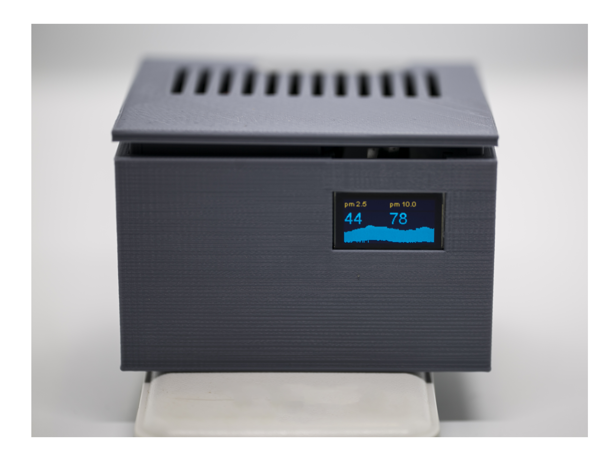

# FinedustMonitor
Fine dust (air pollution) monitoring station. Air pollution monitoring channel updates once every minute with PM 10.0 and PM 2.5 readings from the Nova PM (SDS011) Sensor.  

> **[Please note]**  
This project doesn't support GPS and realtime location tracking capability. For a project that supports GPS and realtime location tracking, please visit the following link : https://github.com/happybono/FinedustMonitorWithGPS

## What's New
### November 24, 2019
> Initial Release.

### December 27, 2019
> [Now supports [Channel Status Updates] in ThingSpeak](https://thingspeak.com/channels/920137) : Updated [FinedustMonitorWithGPS.ino](https://github.com/happybono/FinedustMonitor/commit/2c67b2f0da2b040965968acb8d0f28a61f4c0c7f "/FinedustMonitor/FinedustMonitor.ino"), [server.ino](https://github.com/happybono/FinedustMonitor/commit/0f668a0b3ce72a1ad0b89f1f80e4df6fb47ed87a "/FinedustMonitor/server.ino")

### January 25, 2020
> ["Latest PM sensor readings" plugin added in ThingSpeak.](https://github.com/happybono/FinedustMonitor/tree/master/Plugins/StatusUpdates)

### January 26, 2020
> Various bugs fixed.

### February 20, 2020
> ["Email Alert" function added as a ThingSpeak Analysis plug-in.](https://github.com/happybono/FinedustMonitor/blob/master/Plugins/Email/EmailNotifier.m) 

### May 28, 2020
> [Added 3D modeled housing file.](https://github.com/happybono/FinedustMonitor/blob/master/3DModels/SDS011-Housing.stl)

> 

### June 04, 2020
> Attached a programmed NFC Tag Sticker for faster and more convenient access to the ThingSpeak dashboard.

## Specifications
### Scenarios
* Measuring the fine dust contamination level in the air in real time. The value is displayed on the OLED Screen, and updated every second.
* Measuring the current temperature.
* Refining data and synchronize with the web-based cloud service. (e.g. [ThingSpeak](https://www.thingspeak.com/), [Plaive](https://plaive.10make.com/))

### Connections
* 1 x Micro-USB

### Wireless
* IEEE 802.11 b/g/n Wi-Fi technology.

### Battery life 
* Up to 24 hours of typical device usage.
* Testing consisted of full-time active use until complete battery discharge. 
* Wi-Fi was connected to a network.
* Syncs data once every minute with PM 10.0 and PM 2.5 readings from the Nova PM (SDS011) Sensor and Temperature reading from the DS18820 Temperature Sensor.
* Battery life may varies significantly with settings, usage and other factors.

## Apparatus (Equipment)
### Platform
* ESP8266 NodeMCU

### SDS011 Dust Sensor
* Soldering required.
* D1 : TX of SDS011

### 0.96" I2C OLED Display 
* Soldering required.
* D3 : Data, D2 : Clock

### DS18820 Temperature Sensor (Thermometer)
* Soldering required.
* D4 : Data

### Blank EUB-2300C Portable Battery
* Micro-USB : Power 
* Dimension : W (66.4 mm) × D (95.0 mm) × H (6.5 mm) 
* Input : DC-5V / 0.6A
* Output : DC-5V / 0.6A
* Capacity : 2,300 mAh

### Circular NFC Tag Sticker (N-Tag 216)
* Size : 25.0 mm
* Capacity : 926 Byte
* This should be programmed to automatically opening the ThingSpeak Dashboard when the NFC Capable device has contacting on the NFC Tag Sticker.
* https://www.amazon.com/GoToTags-Blank-White-Metal-NFC/dp/B00TRL774A/ref=sr_1_5?dchild=1&keywords=ntag216&qid=1591593422&sr=8-5

## Data Refinement / Synchronization
* ThingSpeak (https://thingspeak.com/)
* Plaive (https://plaive.10make.com/)

## Drivers
Please install https://github.com/squix78/esp8266-oled-ssd1306

## References
* Rob Tillaart 2018, RobTillaart/Arduino, GitHub, RobTillaart, viewed 23 February 2020, <https://github.com/RobTillaart/Arduino/blob/master/libraries/RunningMedian/RunningMedian.cpp>.
