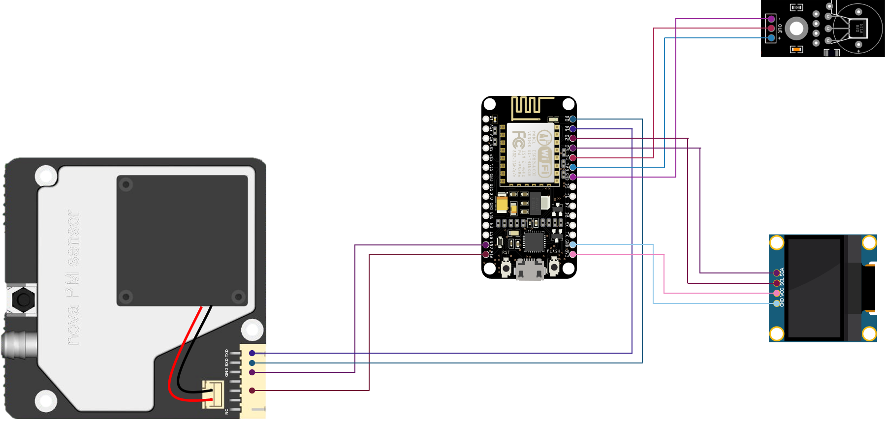

# FinedustMonitor
Fine dust (air pollution) monitoring station. Air pollution monitoring channel updates once every minute with PM 10.0 and PM 2.5 readings from the Nova PM (SDS011) Sensor.  

 

             

> **[Please note]**  
This project doesn't support GPS and realtime location tracking capability. For a project that supports GPS and realtime location tracking, please visit the following link : https://github.com/happybono/FinedustMonitorWithGPS

## What's New   

Click to Expand

  
### v1.0
#### November 24, 2019
> Initial Release.

#### December 27, 2019
> [Now supports [Channel Status Updates] in ThingSpeak](https://thingspeak.com/channels/920137) : Updated [FinedustMonitorWithGPS.ino](https://github.com/happybono/FinedustMonitor/commit/2c67b2f0da2b040965968acb8d0f28a61f4c0c7f "/FinedustMonitor/FinedustMonitor.ino"), [server.ino](https://github.com/happybono/FinedustMonitor/commit/0f668a0b3ce72a1ad0b89f1f80e4df6fb47ed87a "/FinedustMonitor/server.ino")

#### January 25, 2020
> ["Latest PM sensor readings" plugin added in ThingSpeak.](https://github.com/happybono/FinedustMonitor/tree/master/Plugins/StatusUpdates)

#### January 26, 2020
> Various bugs fixed.

### v2.0
#### February 20, 2020
> ["Email Alert" function added as a ThingSpeak Analysis plug-in.](https://github.com/happybono/FinedustMonitor/blob/master/Plugins/Email/EmailNotifier.m) 

#### May 28, 2020
> [Added 3D modeled housing file.](https://github.com/happybono/FinedustMonitor/blob/master/3DModels/SDS011-Housing.stl)

> 

#### June 04, 2020
> Attached a programmed NFC Tag Sticker for faster and more convenient access to the ThingSpeak dashboard.

#### June 11, 2020
> [Fine dust (PM 2.5 and PM 10.0) 3D visualization bar charts added on the ThingSpeak dashboard.](https://github.com/happybono/FinedustMonitor/tree/master/Plugins/Visualizations)

#### June 12, 2020
> [Various bugs fixed those related with fine dust (PM 2.5 and PM 10.0) 3D visualization bar charts.](https://github.com/happybono/FinedustMonitor/tree/master/Plugins/Visualizations)

#### June 16, 2020
> [Supports multiple series (PM 2.5 & PM 10.0) chart as a ThingSpeak plugin.](https://github.com/happybono/FinedustMonitor/tree/master/Plugins/MultiSeriesChart)

#### June 17, 2020
> Various bugs fixed.

#### July 03, 2020
> [Various bugs fixed those related with fine dust (PM 2.5 and PM 10.0) 3D visualization bar charts.](https://github.com/happybono/FinedustMonitor/tree/master/Plugins/Visualizations)

#### July 08, 2020
> [A defect that prevented measurement values from being uploaded under certain environmental conditions has been fixed.](https://github.com/happybono/FinedustMonitor/blob/master/FinedustMonitor/FinedustMonitor.ino)

#### December 30, 2020
> [Various bugs fixed.](https://github.com/happybono/FinedustMonitor/blob/master/FinedustMonitor/FinedustMonitor.ino)

## Specifications
### Scenarios
* Measuring the fine dust contamination level in the air in real time. The value is displayed on the OLED Screen, and updated every second.
* Measuring the current temperature.
* Refining data and synchronize with the web-based cloud service. (e.g. [ThingSpeak](https://www.thingspeak.com/), [Plaive](https://plaive.10make.com/))

### Connections
* 1 x Micro-USB

### Wireless
* IEEE 802.11 b/g/n Wi-Fi technology.

### Battery life 
* Up to 24 hours (1 day) of typical device usage.
* Testing consisted of full-time active use until complete battery discharge. 
* Wi-Fi was connected to a network.
* Syncs data once every minute with PM 10.0 and PM 2.5 readings from the Nova PM (SDS011) Sensor and Temperature reading from the DS18820 Temperature Sensor.
* Battery life may vary significantly with settings, usage and other factors.

## Apparatus (Equipment)
### Platform
* NodeMCU ESP8266-12E

### SDS011 Dust Sensor
* Soldering required.
* D1 : TX of SDS011

### 0.96" SSD1306 I2C OLED Display 
* Soldering required.
* D3 : Data, D2 : Clock

### DS18B20 Temperature Sensor (Thermometer)
* Soldering required.
* D4 : Data

### Blank EUB-2300C Portable Battery
* Micro-USB : Power 
* Dimension : W (66.4 mm) × D (95.0 mm) × H (6.5 mm) 
* Input : DC-5V / 0.6A
* Output : DC-5V / 0.6A
* Capacity : 2,300 mAh

### Circular NFC Tag Sticker (N-Tag 216)
* Size : 25.0 mm
* Capacity : 926 Byte
* This should be programmed to automatically opening the ThingSpeak Dashboard when the NFC Capable device has contacting on the NFC Tag Sticker.
* https://www.amazon.com/GoToTags-Blank-White-Metal-NFC/dp/B00TRL774A/ref=sr_1_5?dchild=1&keywords=ntag216&qid=1591593422&sr=8-5

## Schematics

## Data Refinement / Synchronization
* ThingSpeak (https://thingspeak.com/)
* Plaive (https://plaive.10make.com/)

## Libraries Used
### DallasTemperature
This library supports the following devices :

DS18B20  
DS18S20 - Please note there appears to be an issue with this series.  
DS1822  
DS1820  
MAX31820  
https://github.com/milesburton/Arduino-Temperature-Control-Library

### SSD1306 (0.96") OLED Display
This is a driver for SSD1306 128x64, 128x32, 64x48 and 64x32 OLED displays running on the Arduino/ESP8266 & ESP32 and mbed-os platforms. Can be used with either the I2C or SPI version of the display.  
https://www.github.com/ThingPulse/esp8266-oled-ssd1306

### RunningMedian
Arduino library to determine the running median by means of a circular buffer.

Running Median looks like a running average with a small but important twist. Running average averages the last N samples while the running median takes the last N samples, sort them and take the middle one, or the average of the middle two.

Important differences between running average and running median:
* Running median will return real data (e.g. a real sample from a sensor) if one uses an odd size of the buffer (preferred). Running average may return a value that is never sampled.
* Running median will give zero weight to outliers, and 100% to the middle sample, whereas running average gives the same weight to all samples.
* Running median will give often constant values for some time.
* As one knows the values in the buffer one can predict to some extend how much the next samples will change the running median.
* Running median is a bit harder as one needs to keep the values in order to remove the oldest and keep them sorted to be able to select the median. 
https://github.com/RobTillaart/Arduino/tree/master/libraries/RunningMedian

## References
* Rob Tillaart 2018, RobTillaart/Arduino, GitHub, RobTillaart, viewed 23 February 2020, <https://github.com/RobTillaart/Arduino/blob/master/libraries/RunningMedian/RunningMedian.cpp>.
